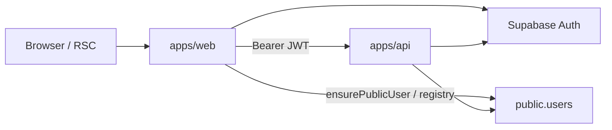
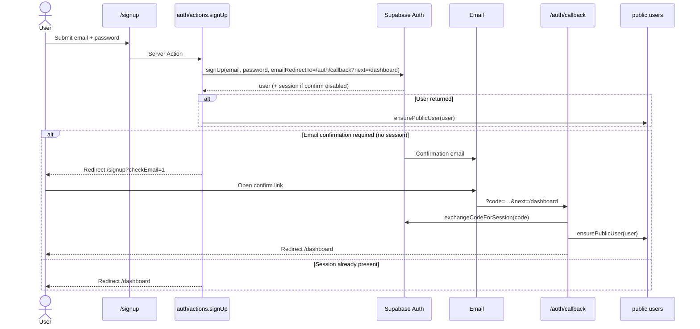
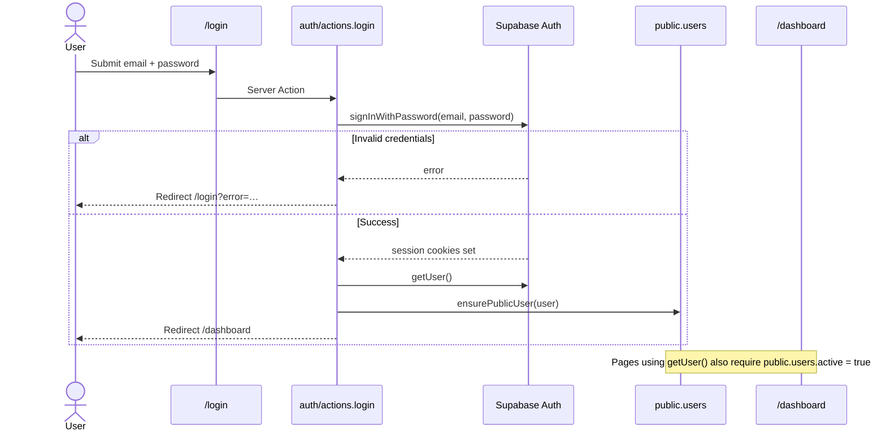
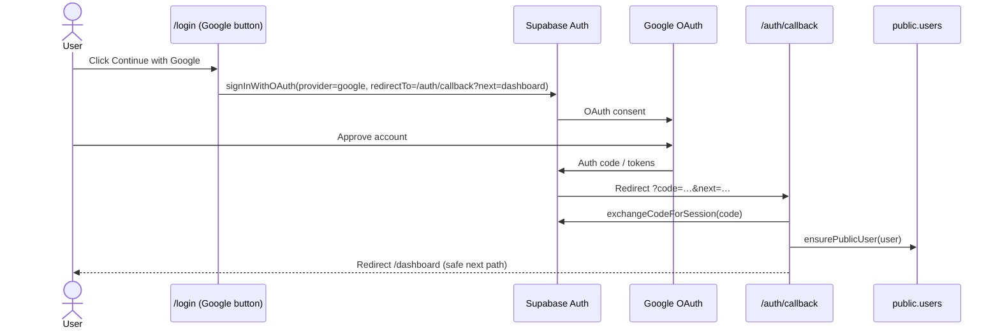
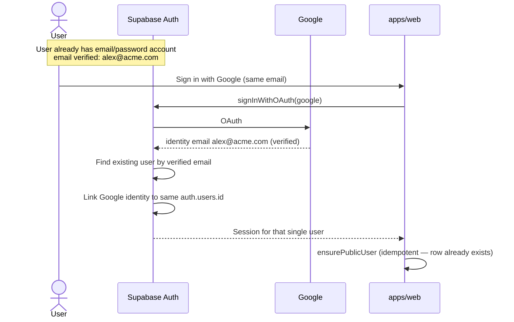
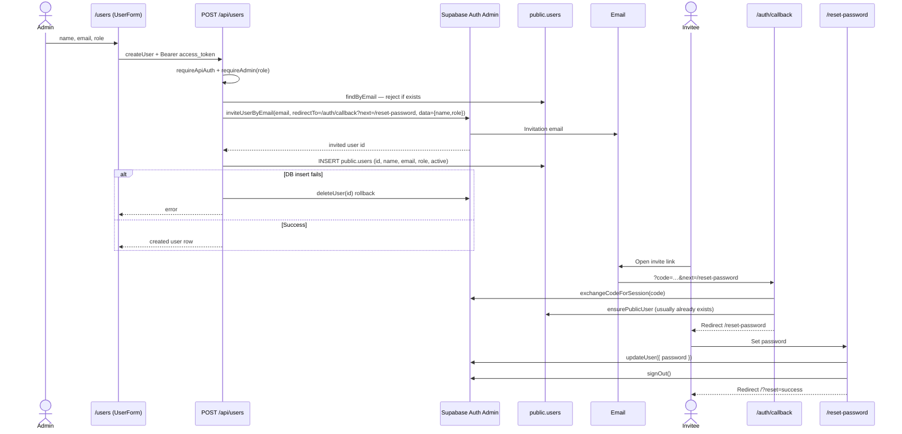
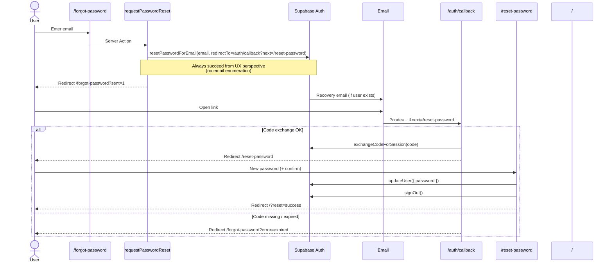
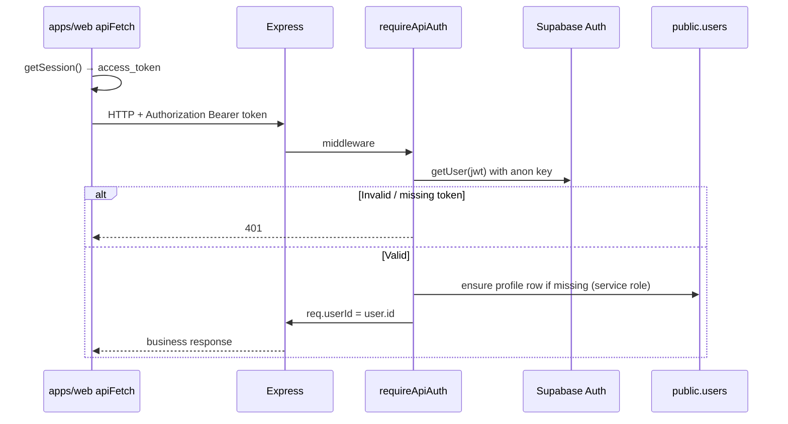

# Authentication

Living guide to how identity works in **Alice** (Jira Teams): email/password, Google OAuth, session handling, admin invites, password reset, and how emails relate across accounts.

| Field             | Value                  |
| ----------------- | ---------------------- |
| Status            | **Living**             |
| Last updated      | 2026-07-20             |
| Primary apps      | `apps/web`, `apps/api` |
| Identity provider | Supabase Auth          |
| App profile table | `public.users`         |

Related:

- [Auth index](./README.md)
- [RBAC plan](./RBAC_AUTHORIZATION_SKELETON.md) — page-level authorization (partial)
- [User management](../features/users/USER_MANAGEMENT.md) — registry UI and roles
- [Forgot-password plan](./FORGOT_PASSWORD_AUTH_PLAN.md) — historical plan; this doc is the as-built source of truth

---

## 1. Mental model

| Concern                                 | Source of truth                                                      |
| --------------------------------------- | -------------------------------------------------------------------- |
| Credentials, sessions, OAuth identities | Supabase Auth (`auth.users`, `auth.identities`)                      |
| Display name, role, `active` flag       | Application table `public.users`                                     |
| Web session cookies                     | `@supabase/ssr` (Next.js server + proxy refresh)                     |
| API calls                               | `Authorization: Bearer <access_token>` validated by `requireApiAuth` |

**Rule:** Authentication is Supabase. Authorization for product actions uses `public.users.role` / `active` (and API helpers), not editable Auth `user_metadata` as the long-term RBAC source of truth. Metadata may still be written on invite for bootstrap (name/role) and copied into `public.users` on first profile create.

### High-level architecture

### Key routes

| Route              | Purpose                                                                       |
| ------------------ | ----------------------------------------------------------------------------- |
| `/login`           | Email/password + Google sign-in                                               |
| `/signup`          | Email/password registration                                                   |
| `/forgot-password` | Request recovery email                                                        |
| `/reset-password`  | Set a new password (requires session)                                         |
| `/auth/callback`   | PKCE `code` → session (OAuth, confirm, invite, recovery)                      |
| `/auth/confirm`    | Optional `verifyOtp(token_hash)` UI — **not used** by current email templates |
| `/users`           | Admin invite / activate / deactivate                                          |

### Key code

| Area                  | Path                                                           |
| --------------------- | -------------------------------------------------------------- |
| Auth Server Actions   | `apps/web/app/auth/actions.ts`                                 |
| OAuth callback        | `apps/web/app/auth/callback/route.ts`                          |
| Profile bootstrap     | `apps/web/lib/ensure-public-user.ts`                           |
| Session helpers       | `apps/web/lib/auth.ts` (`getUser`, `getDbUser`, `getUserRole`) |
| Session refresh       | `apps/web/proxy.ts` → `lib/supabase/middleware.ts`             |
| Google button         | `apps/web/app/login/_components/google-login.tsx`              |
| Reset password action | `apps/web/app/reset-password/actions.ts`                       |
| API JWT gate          | `apps/api/src/middlewares/auth/index.ts`                       |
| Admin invite          | `apps/api/src/routes/api/users/users.service.ts`               |

---

## 2. Sign up (email / password)

Self-service registration creates an Auth user, optionally requires email confirmation, then ensures a `public.users` row.

### Sequence

### Notes

- `emailRedirectTo` is built from the request origin / `NEXT_PUBLIC_SITE_URL` via `buildAuthCallbackUrl`.
- Default role for self-signup profiles is **`member`** (`ensurePublicUser` → `resolveRole`).
- Confirmation depends on the Supabase project setting “Confirm email”.

---

## 3. Sign in (email / password)

### Sequence

### Active flag

`getUser()` in `apps/web/lib/auth.ts` loads `public.users.active` by email. If `active === false`, it returns `null` (user appears signed out for gated UI). Deactivate also bans the Auth user via the API (see §6).

### Sign out

`signOut` Server Action → `supabase.auth.signOut()` → redirect `/`.

---

## 4. Sign in with Google

Google OAuth is available on **`/login`** (not on `/signup`). The provider must be enabled in the Supabase dashboard (Google client ID/secret).

### Sequence

### Implementation details

- Client: `supabase.auth.signInWithOAuth` with `queryParams: { access_type: 'offline', prompt: 'select_account' }`.
- Callback sets SSR cookies, then `ensurePublicUser` (name from Google metadata / email local-part; role defaults to `member` unless metadata carries a valid app role).
- `resolveSafeRedirectPath` prevents open redirects; invalid `next` falls back to `/dashboard`.

### Dashboard / env checklist

1. Supabase → Authentication → Providers → **Google** enabled.
2. Google Cloud OAuth client with authorized redirect URI pointing at Supabase’s callback URL.
3. App env: `NEXT_PUBLIC_SUPABASE_URL`, `NEXT_PUBLIC_SUPABASE_ANON_KEY` (web). Provider secrets live in Supabase, not in the Next.js client bundle.

---

## 5. Linking emails / identities between accounts

Alice does **not** implement app-level account linking UI (`linkIdentity` / `unlinkIdentity` are unused). Linking behavior today is whatever **Supabase Auth** does for the project.

### 5.1 Automatic linking (platform default)

Supabase can automatically attach a new OAuth identity to an **existing** Auth user when:

- The OAuth email matches an existing user’s email, and
- That email is **verified** (unverified identities are not used as a safe link target; Supabase may drop other unconfirmed identities when linking).

**Implications for Alice:**

- One `auth.users.id` → one `public.users` row (same UUID). Automatic linking avoids duplicate registry rows for the same verified email.
- If emails differ (e.g. Google uses another address), Supabase creates a **separate** Auth user unless the user manually links (not built in our UI).
- SAML SSO identities are **not** targets for automatic linking (Supabase security rule).

Official reference: [Supabase Identity Linking](https://supabase.com/docs/guides/auth/auth-identity-linking).

### 5.2 Manual linking (not implemented in Alice)

Supabase supports (when enabled in project Auth settings):

| API                                                  | Purpose                                                                    |
| ---------------------------------------------------- | -------------------------------------------------------------------------- |
| `supabase.auth.linkIdentity({ provider: 'google' })` | While signed in, attach another OAuth identity (can use a different email) |
| `supabase.auth.unlinkIdentity(identity)`             | Remove a linked identity                                                   |
| `supabase.auth.getUserIdentities()`                  | List identities on the current user                                        |
| `supabase.auth.updateUser({ email })`                | Change / add email identity (with verification)                            |

**Planned product work (optional):** profile settings to “Connect Google” / “Disconnect Google”, enable manual linking in Supabase, and document conflict UX when the Google email already belongs to another Auth user.

### 5.3 Email collision matrix (practical)

| Existing account         | New attempt                     | Typical result                                                                                         |
| ------------------------ | ------------------------------- | ------------------------------------------------------------------------------------------------------ |
| Email/password, verified | Google, **same** verified email | Automatic link → one user                                                                              |
| Email/password           | Sign up again, same email       | Auth rejects / “already registered”                                                                    |
| Google-only              | Email signup, same email        | Depends on confirm + linking settings; often blocked or linked after verify                            |
| Two different emails     | User wants one login            | Needs **manual** linking (not in app today)                                                            |
| Admin invite pending     | Self-signup same email          | Duplicate risk — admins should invite first; registry checks `public.users` email uniqueness on invite |

---

## 6. Admin creates / invites users

Administrators add teammates from `/users`. The UI calls the **Express API** (Bearer JWT). The API uses the Supabase **service role** to invite and write `public.users`.

### Sequence

### Activate / deactivate

- API toggles `public.users.active` and Auth `ban_duration` so deactivated users cannot keep using tokens effectively.
- Web `getUser()` treats inactive registry rows as unauthenticated for UI gates.

### Security notes

- Only `public.users.role === 'admin'` may invite or toggle via API.
- `SUPABASE_SERVICE_ROLE_KEY` must stay server-only (API / web server admin client) — never `NEXT_PUBLIC_*`.

More UI/schema detail: [USER_MANAGEMENT.md](../features/users/USER_MANAGEMENT.md).

---

## 7. Forgot password and password reset

Self-service recovery uses Supabase recovery emails and the shared `/auth/callback` PKCE exchange. The same `/reset-password` page is reused after **admin invite**.

### Sequence

### Guards

- `/reset-password` **layout** requires a signed-in user (`getUser()`); otherwise redirect to `/forgot-password`.
- Session may come from recovery **or** invite; the layout does not distinguish recovery-only sessions.
- After a successful reset, the app **signs the user out** so they sign in with the new password.

### Difference from admin invite

| Step                | Forgot password                      | Admin invite                        |
| ------------------- | ------------------------------------ | ----------------------------------- |
| Starts with         | `resetPasswordForEmail`              | `inviteUserByEmail`                 |
| Email type          | Recovery                             | Invite                              |
| Sets `public.users` | Already exists                       | Created at invite time              |
| Ends at             | `/?reset=success` after set password | Same reset page → `/?reset=success` |

---

## 8. API authentication

Admin-only user mutations additionally call `requireAdmin` inside `UsersService`.

---

## 9. Session refresh and security

- **Proxy / middleware:** `apps/web/proxy.ts` refreshes Auth cookies via `updateSession` on matching routes. It does **not** globally block anonymous access; pages/layouts enforce `getUser()` where needed.
- **Do not** authorize with client-editable `user_metadata` alone for RBAC decisions long-term — see [RBAC skeleton](./RBAC_AUTHORIZATION_SKELETON.md).
- **Service role** only on server (invite, ban, `ensurePublicUser` inserts).
- Redirect targets after Auth emails must stay on allowlisted paths (`resolveSafeRedirectPath`).

---

## 10. Environment variables (names only)

### Web (`apps/web`)

| Variable                        | Role                                               |
| ------------------------------- | -------------------------------------------------- |
| `NEXT_PUBLIC_SUPABASE_URL`      | Supabase project URL                               |
| `NEXT_PUBLIC_SUPABASE_ANON_KEY` | Browser / SSR anon key                             |
| `SUPABASE_SERVICE_ROLE_KEY`     | Server admin client (profile ensure, etc.)         |
| `NEXT_PUBLIC_SITE_URL`          | Canonical origin for email `redirectTo` (optional) |
| `NEXT_PUBLIC_API_URL`           | API base for Bearer calls                          |

### API (`apps/api`)

| Variable                    | Role                                 |
| --------------------------- | ------------------------------------ |
| `SUPABASE_URL`              | Supabase URL                         |
| `SUPABASE_ANON_KEY`         | JWT verification in `requireApiAuth` |
| `SUPABASE_SERVICE_ROLE_KEY` | Invites, bans, privileged DB         |
| `FRONTEND_URL`              | CORS / frontend origin               |

---

## 11. Capability matrix

| Capability                                       | Status in Alice                           |
| ------------------------------------------------ | ----------------------------------------- |
| Email/password sign up                           | Implemented                               |
| Email/password sign in                           | Implemented                               |
| Sign out                                         | Implemented                               |
| Google OAuth sign in                             | Implemented (`/login`)                    |
| Google on sign-up page                           | Not present                               |
| Automatic identity linking (same verified email) | Platform (Supabase); no app code          |
| Manual link / unlink UI                          | **Not implemented**                       |
| Admin invite + set password                      | Implemented (API + `/users`)              |
| Activate / deactivate                            | Implemented                               |
| Forgot / reset password                          | Implemented                               |
| `/auth/confirm` token-hash flow                  | Code present; emails use `/auth/callback` |
| Full page-level RBAC                             | Partial — see RBAC skeleton               |

---

## 12. Troubleshooting

| Symptom                                       | Likely cause                                                                             |
| --------------------------------------------- | ---------------------------------------------------------------------------------------- |
| Google button fails immediately               | Provider disabled or redirect URL mismatch in Supabase / Google Cloud                    |
| Invite / reset link lands on login error      | Expired or already-used `code`; recovery failures go to `/forgot-password?error=expired` |
| User signed in Auth but missing from registry | `ensurePublicUser` failed (check service role + RLS/grants on `public.users`)            |
| Deactivated user still sees UI briefly        | Stale cookie until `getUser()` runs; Auth ban should block API                           |
| Two registry rows for “same person”           | Different Auth user IDs (different emails or linking never occurred)                     |
