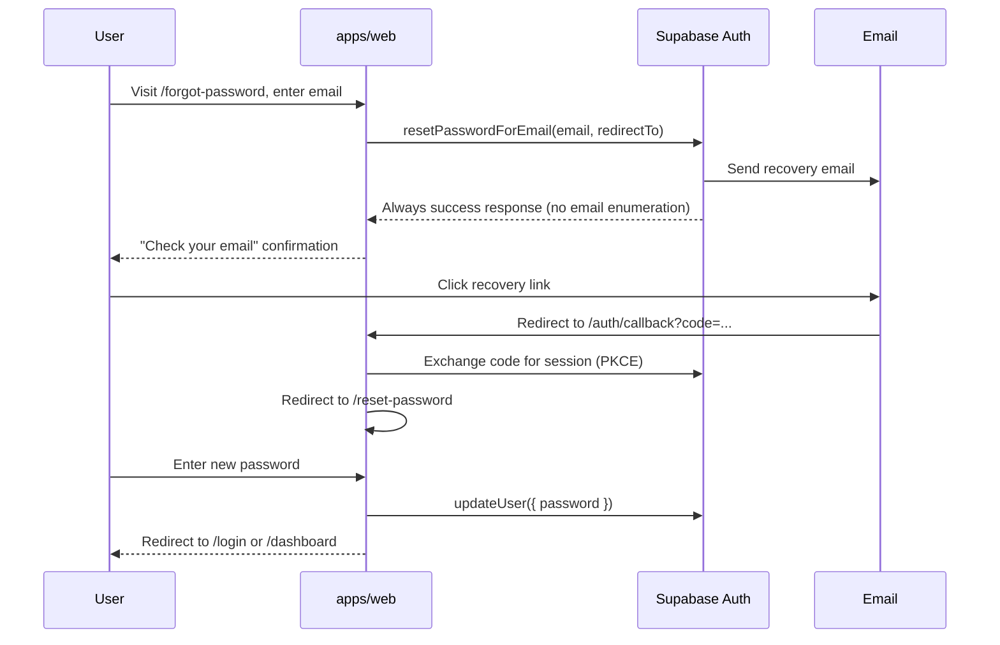

# Forgot Password — Supabase Auth Plan

## Document Metadata

- Project: Alice (Jira Teams)
- Area: Web Authentication (`apps/web`)
- Version: 0.1 (Draft)
- Status: Plan — **as-built flows live in [AUTHENTICATION.md](./AUTHENTICATION.md) §7**
- Owner: TBD
- Last Updated: 2026-06-28 (status note 2026-07-20)
- Depends on: Supabase Auth (email/password), `@supabase/ssr`, existing `app/auth/actions.ts` patterns

## 1. Goal

Allow users who forgot their password to securely reset it via email, using Supabase Auth — without custom token storage or a separate auth provider.

**Out of scope for v1:** magic-link-only login, SMS OTP, admin-initiated password resets.

## 2. User Flow



## 3. Routes and Files (proposed)

| Route              | Type          | Purpose                                       |
| ------------------ | ------------- | --------------------------------------------- |
| `/forgot-password` | RSC page      | Email form → Server Action                    |
| `/auth/callback`   | Route Handler | Exchange auth code, set session cookies       |
| `/reset-password`  | RSC page      | New password form (requires recovery session) |

| File                           | Purpose                                                     |
| ------------------------------ | ----------------------------------------------------------- |
| `app/forgot-password/page.tsx` | UI: email input, submit, generic success message            |
| `app/reset-password/page.tsx`  | UI: new password + confirm, submit                          |
| `app/auth/callback/route.ts`   | `exchangeCodeForSession` via server Supabase client         |
| `app/auth/actions.ts`          | Add `requestPasswordReset`, `updatePassword` Server Actions |

Reuse `@repo/ui` primitives (`Button`, `Input`, `Label`, `Card`) per UI design rules.

## 4. Server Actions

### `requestPasswordReset(formData)`

```typescript
// Pseudocode — implement in app/auth/actions.ts
const email = String(formData.get('email') ?? '');
const supabase = await createClient();
const origin = /* from headers or NEXT_PUBLIC_SITE_URL */;

await supabase.auth.resetPasswordForEmail(email, {
  redirectTo: `${origin}/auth/callback?next=/reset-password`,
});
// Always redirect to success — do not reveal whether email exists
redirect('/forgot-password?sent=1');
```

### `updatePassword(formData)`

```typescript
const password = String(formData.get('password') ?? '');
const supabase = await createClient();
const { error } = await supabase.auth.updateUser({ password });
// Handle weak password / same password errors
redirect('/login?reset=success');
```

Both actions use `createClient()` from `@/lib/supabase/server` — **anon key + cookies**, never service role.

## 5. Supabase Dashboard Configuration

Before testing or deploying:

1. **Authentication → URL configuration**
   - Site URL: production web URL (e.g. `https://your-app.vercel.app`)
   - Redirect URLs (allow list):
     - `http://localhost:3000/auth/callback`
     - `https://<production-domain>/auth/callback`

2. **Authentication → Email templates**
   - Customize "Reset password" template branding (optional).
   - Confirm sender domain if using custom SMTP.

3. **Email auth enabled** under Authentication → Providers → Email.

4. **Password policy** (minimum length, etc.) under Authentication → Settings — align UI validation with Supabase rules.

## 6. Environment Variables

| Variable                          | Where | Notes                                           |
| --------------------------------- | ----- | ----------------------------------------------- |
| `NEXT_PUBLIC_SUPABASE_URL`        | web   | Already required                                |
| `NEXT_PUBLIC_SUPABASE_ANON_KEY`   | web   | Already required                                |
| `NEXT_PUBLIC_SITE_URL` (optional) | web   | Canonical origin for `redirectTo` in production |

Add to `apps/web/sample.env` and `lib/env.ts` when implemented.

## 7. Security Considerations

| Risk                   | Mitigation                                                                                                                    |
| ---------------------- | ----------------------------------------------------------------------------------------------------------------------------- |
| Email enumeration      | Show the same success message whether or not the email is registered (Supabase default behaviour for `resetPasswordForEmail`) |
| Open redirect          | Only allow `next` paths that are relative (`/reset-password`), never arbitrary URLs                                           |
| Service role exposure  | Never use `SUPABASE_SERVICE_ROLE_KEY` in forgot-password flow                                                                 |
| Session fixation       | Use `@supabase/ssr` callback handler; let SDK manage cookie rotation                                                          |
| Weak passwords         | Validate client-side for UX; Supabase enforces server-side policy                                                             |
| Rate limiting          | Rely on Supabase Auth rate limits; monitor abuse in dashboard                                                                 |
| CSRF on Server Actions | Next.js Server Actions include built-in protection                                                                            |

## 8. UX Requirements

- Link on `/login`: "Forgot password?"
- After submit on `/forgot-password`: neutral copy — e.g. "If an account exists for that email, we sent a reset link."
- `/reset-password` accessible only with a valid recovery session; otherwise redirect to `/forgot-password`
- Password confirmation field with match validation before submit
- Clear error display for expired or invalid recovery links (redirect to `/forgot-password?error=expired`)

## 9. Middleware / Session

- `proxy.ts` / `updateSession()` continues to refresh sessions on all routes.
- `/auth/callback` must be included in the middleware matcher (already covered by existing pattern).
- Do not require authentication for `/forgot-password`; require recovery session for `/reset-password`.

## 10. API Impact

None for v1. Password reset is web-only via Supabase Auth. The API continues to accept Bearer tokens issued after the user signs in with the new password.

## 11. Rollout Plan

| Phase | Tasks                                                      |
| ----- | ---------------------------------------------------------- |
| 1     | Supabase redirect URL config (local + prod)                |
| 2     | `/auth/callback` route handler                             |
| 3     | `/forgot-password` page + `requestPasswordReset` action    |
| 4     | `/reset-password` page + `updatePassword` action           |
| 5     | Login page link + env updates (`sample.env`, `lib/env.ts`) |
| 6     | Manual test: full flow local → staging → production        |

## 12. Test Plan

- [ ] Request reset for registered email → receive mail → set new password → sign in succeeds
- [ ] Request reset for unknown email → same success UI, no mail (no leak)
- [ ] Expired recovery link → friendly error, can request again
- [ ] `redirectTo` not in allow list → Supabase rejects (verify config)
- [ ] Old password no longer works after reset
- [ ] Session after reset: user can reach `/dashboard`

## 13. Open Questions

- Redirect to `/dashboard` or `/login` after successful password update?
- Require re-authentication on all devices (Supabase sign-out global sessions) after reset?
- Add `NEXT_PUBLIC_SITE_URL` or derive origin from request headers only?

## 14. References

- [Supabase — Password-based auth](https://supabase.com/docs/guides/auth/passwords)
- [Supabase — SSR reset password flow](https://supabase.com/docs/guides/auth/server-side/nextjs)
- Project rules: `.cursor/rules/02-agent-identity-manager.mdc`
- TRD §5 Authentication
