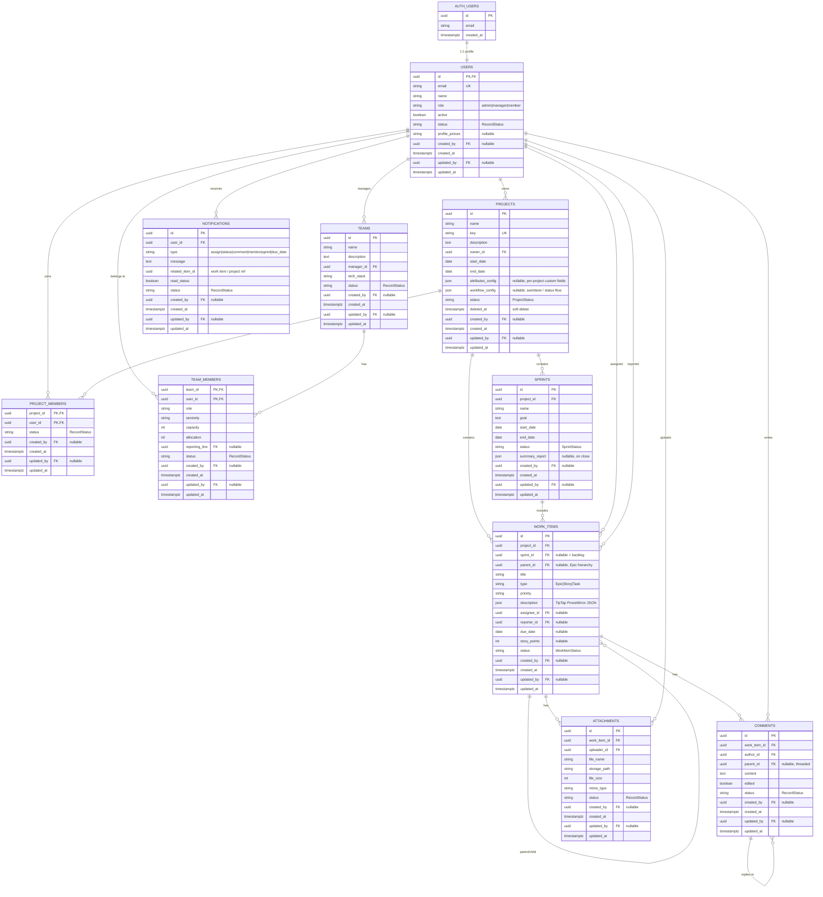

# Entity-Relationship Diagram — 1BT-JIRA

## Document metadata

| Field        | Value                                                              |
| ------------ | ------------------------------------------------------------------ |
| Project      | Alice (1BT Project Management System / Jira Teams)                 |
| Source       | `1BT-JIRA Task Breakdown with Team Assignments.xlsx` (MVP 1–4)     |
| Status       | Implemented — `init_jira_domain` + audit migrations + project JSON config |
| Last updated | 2026-07-16                                                                  |

Related:

- `docs/guidelines/DATABASE.md` — migrations and workflow
- `docs/database/AUDIT_COLUMNS.md` — audit column conventions and `@repo/types/audit` helpers
- `docs/database/WORK_ITEM_DESCRIPTION.md` — TipTap JSON format for `work_items.description`
- `docs/features/users/USER_MANAGEMENT.md` — `public.users` (partially implemented)
- `docs/authorization/RBAC_AUTHORIZATION_SKELETON.md` — authorization rollout

---

## Design assumptions

| Topic               | Decision                                                                                   |
| ------------------- | ------------------------------------------------------------------------------------------ |
| Identity            | Supabase `auth.users` for sign-in; `public.users` for app profile and RBAC                 |
| Roles               | `admin`, `manager`, `member` on `users.role` (S-09 seeds roles)                            |
| Backlog             | Not a separate table — `work_items` where `sprint_id IS NULL` (BL-01)                      |
| Sprint assignment   | `work_items.sprint_id`; assign/unassign via backlog and sprint APIs (BL-04, BL-05, SPR-03) |
| Work item hierarchy | Self-referential `parent_id` for Epic → Story → Task (WI-07)                               |
| Rich text           | `work_items.description` stored as TipTap/ProseMirror JSON (see `WORK_ITEM_DESCRIPTION.md`) |
| Project config      | `projects.attributes_config` and `projects.workflow_config` JSON — per-project task fields and swimlanes |
| Soft delete         | `projects.deleted_at` for soft delete; hard delete is Admin-only (PROJ-04)                 |
| Audit metadata      | All tables: `created_by`, `created_at`, `updated_by`, `updated_at`; see below              |

---

## ER-diagram



---

## Entity summary

| Entity            | Task references                 | Purpose                                                   |
| ----------------- | ------------------------------- | --------------------------------------------------------- |
| `auth.users`      | A-01, A-02                      | Supabase Auth identity (Google SSO, sessions)             |
| `users`           | S-08, U-01–U-03, A-05, PROF-01  | App profile, RBAC role, active flag                       |
| `projects`        | PROJ-01–PROJ-08                 | Project CRUD, members, soft/hard delete                   |
| `project_members` | PROJ-01, PROJ-02                | Users assigned to a project                               |
| `teams`           | TM-01–TM-06                     | Team CRUD and manager                                     |
| `team_members`    | TM-03–TM-04                     | Member attributes (capacity, seniority, allocation)       |
| `sprints`         | SPR-01–SPR-05                   | Sprint lifecycle, burndown, summary on close              |
| `work_items`      | WI-01–WI-08, WF-01, BL-01–BL-05 | Issues, hierarchy, workflow, backlog                      |
| `comments`        | CMT-01–CMT-05                   | Threaded comments and @mentions                           |
| `attachments`     | ATT-01–ATT-04                   | File uploads on work items                                |
| `notifications`   | NOTIF-01–NOTIF-04               | In-app alerts (assign, status, mention, sprint, due date) |

---

## Relationship overview

```
auth.users ──1:1──► users
users ──M:N──► projects        (via project_members)
users ──M:N──► teams           (via team_members)
projects ──1:N──► sprints
projects ──1:N──► work_items
sprints ──0:N──► work_items    (null sprint_id = backlog)
work_items ──self──► work_items (Epic → Story → Task)
work_items ──1:N──► comments, attachments
users ──1:N──► notifications
```

---

## Implementation status

| Entity        | In `schema.prisma` today                        |
| ------------- | ----------------------------------------------- |
| `instruments` | Yes — dev baseline with full audit columns      |
| `users`       | Yes — `init_jira_domain` + audit migrations     |
| `projects`    | Yes — includes `attributes_config`, `workflow_config` JSON |
| `teams`, etc. | Yes — `init_jira_domain` + audit migrations     |

When implementing, add tables via `packages/db/prisma/schema.prisma` and `pnpm db create:migrate:win <name>`. Each migration appends Supabase grants automatically (see `docs/guidelines/DATABASE.md`).

---

## Audit metadata

Every table includes:

| Column       | Type        | Notes                                        |
| ------------ | ----------- | -------------------------------------------- |
| `created_by` | UUID FK     | Nullable → `users.id`, `ON DELETE SET NULL`  |
| `created_at` | timestamptz | Defaults to `now()`                          |
| `updated_by` | UUID FK     | Nullable → `users.id`, `ON DELETE SET NULL`  |
| `updated_at` | timestamptz | Set on write via `@repo/types/audit` helpers |

Full reference: [`AUDIT_COLUMNS.md`](./AUDIT_COLUMNS.md).

---

## Open questions

- Should `teams` link to `projects`, or remain org-wide?
- Store sprint summary as JSON on `sprints`, or a separate `sprint_reports` table?
- Should `notifications.related_item_id` use a polymorphic `(entity_type, entity_id)` pair?
- Add `user_activity` / audit log table for PROF-04, or derive from existing `created_by` / `updated_by` columns?
