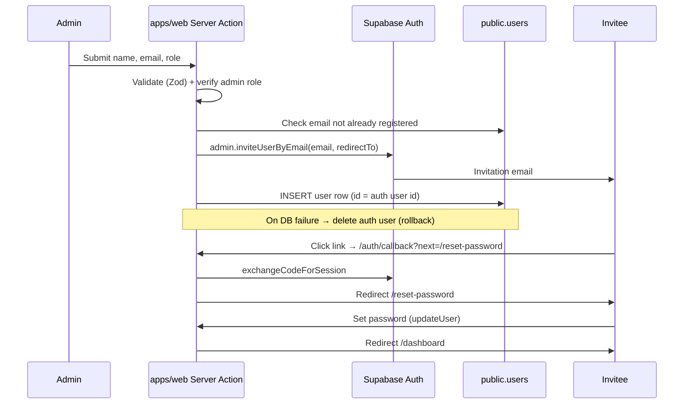

# User Management

## Document metadata

| Field        | Value                                  |
| ------------ | -------------------------------------- |
| Project      | Alice (Jira Teams)                     |
| Area         | Web — `apps/web/app/users`             |
| Version      | 1.0                                    |
| Status       | Implemented (partial RBAC enforcement) |
| Last updated | 2026-06-30                             |

Related:

- `docs/auth/AUTHENTICATION.md` — living auth guide (admin invite + reset sequences)
- `docs/auth/RBAC_AUTHORIZATION_SKELETON.md` — full RBAC rollout plan
- `docs/auth/FORGOT_PASSWORD_AUTH_PLAN.md` — original password-reset plan
- `docs/guides/DATABASE.md` — `public.users` schema and migrations

---

## Overview

User management lets workspace administrators register team members, assign roles (`admin`, `manager`, `member`), and control whether accounts are active. Identity is provisioned through **Supabase Auth invite emails**; authorization data lives in the application-owned **`public.users`** table.

| Concern                 | Source of truth                                   |
| ----------------------- | ------------------------------------------------- |
| Sign-in / sessions      | Supabase Auth (`auth.users`)                      |
| Role, name, active flag | `public.users` (PostgreSQL)                       |
| Admin-only mutations    | Server Actions (`createUser`, `toggleUserActive`) |

---

## Routes and UI

| Route             | Access today                      | Purpose                             |
| ----------------- | --------------------------------- | ----------------------------------- |
| `/users`          | Any signed-in user                | User registry list + add-user modal |
| `/auth/callback`  | Public (invite/reset links)       | Exchanges auth code for session     |
| `/reset-password` | User with recovery/invite session | Set initial or new password         |

**Navigation:** Dashboard sidebar → **Users** (`/users`).

### Components

| File                          | Role                                                       |
| ----------------------------- | ---------------------------------------------------------- |
| `app/users/page.tsx`          | Server page — loads `public.users`, wraps `DashboardShell` |
| `app/users/user-registry.tsx` | Client list, activate/deactivate, add-user modal           |
| `app/users/user-form.tsx`     | Client form — name, email, role                            |
| `app/users/actions.ts`        | Server Actions — `createUser`, `toggleUserActive`          |
| `lib/auth.ts`                 | `getUser`, `getDbUser`, `getUserRole`                      |
| `lib/supabase/admin.ts`       | Service-role client (server-only) for invites and bans     |

---

## Data model — `public.users`

Defined in `packages/db/prisma/schema.prisma` and typed via `@repo/types`.

| Column       | Type            | Description                                        |
| ------------ | --------------- | -------------------------------------------------- |
| `id`         | UUID            | Matches `auth.users.id` after invite               |
| `email`      | string (unique) | Login email                                        |
| `name`       | string          | Display name                                       |
| `role`       | string          | `admin`, `manager`, or `member` (default `member`) |
| `active`     | boolean         | `false` blocks sign-in via `getUser()`             |
| `created_at` | timestamptz     | Registry timestamp                                 |

Roles are stored in **application data**, not in Supabase Auth metadata for authorization decisions (see RBAC skeleton).

---

## Adding a user (invitation email flow)

Only callers with `public.users.role === 'admin'` can successfully run `createUser`. The flow:



### Step-by-step

1. **Admin opens** `/users` → **Add User** → fills name, email, workspace role.
2. **`createUser` Server Action** validates input and confirms the current user is an admin (`getDbUser().role === 'admin'`).
3. **Duplicate check** — rejects if email already exists in `public.users`.
4. **Supabase invite** — `auth.admin.inviteUserByEmail` with:
   - `redirectTo`: `{origin}/auth/callback?next=/reset-password`
   - `data`: `{ name, role }` (auth metadata only; not used for RBAC enforcement)
5. **Database insert** — row in `public.users` with `id` from the invited auth user, `active: true`.
6. **Rollback** — if insert fails, `auth.admin.deleteUser` removes the orphaned auth record.
7. **Invitee** receives email, completes callback, sets password on `/reset-password`, then lands on `/dashboard`.

### Supabase dashboard requirements

- **Authentication → URL configuration:** allow `http://localhost:3000/auth/callback` and production callback URL.
- **Email provider** enabled; customize invite template if needed.
- **Service role key** available to the web app server (`SUPABASE_SERVICE_ROLE_KEY` in `lib/env.ts`) — never exposed to the browser.

---

## Activate / deactivate users

`toggleUserActive` is **admin-only** (same check as `createUser`).

| Action     | `public.users`   | Supabase Auth            |
| ---------- | ---------------- | ------------------------ |
| Deactivate | `active = false` | `ban_duration: '87600h'` |
| Activate   | `active = true`  | `ban_duration: 'none'`   |

**Self lockout protection:** an admin cannot deactivate their own account.

**Sign-in gate:** `getUser()` in `lib/auth.ts` returns `null` when `public.users.active` is `false`, so deactivated users cannot access protected pages even if a session cookie remains.

---

## Authorization status (RBAC)

### Enforced today (Server Actions)

| Action             | Admin required?                                    |
| ------------------ | -------------------------------------------------- |
| `createUser`       | Yes — `currentUser.role !== 'admin'` returns error |
| `toggleUserActive` | Yes — same check                                   |

### Not yet strictly enforced

| Gap                      | Current behaviour                                             | Planned                                                      |
| ------------------------ | ------------------------------------------------------------- | ------------------------------------------------------------ |
| **`/users` page access** | Any authenticated user can open `/users` and see the registry | Route/layout guard: admin-only                               |
| **Add User UI**          | Button visible to all signed-in users on `/users`             | Hide unless `getUserRole() === 'admin'`                      |
| **Role dashboards**      | `/admin`, `/manager`, `/member` require sign-in only          | Redirect by `public.users.role`                              |
| **Shared guard helper**  | Checks duplicated in actions                                  | Central `requireAdmin()` / `requireRole()` per RBAC skeleton |

Server Actions already reject non-admins, but **the page and UI are not admin-gated yet**. Treat full admin-only access as **planned RBAC work**, not complete.

See `docs/auth/RBAC_AUTHORIZATION_SKELETON.md` for the target architecture.

---

## Auth helpers

```typescript
// lib/auth.ts (simplified)
getUser(); // Supabase auth user + active check against public.users
getDbUser(); // Full public.users row for current email
getUserRole(); // dbUser.role or null
```

Use `getDbUser()` / `getUserRole()` for authorization checks in Server Actions and RSC pages.

---

## Environment variables

Required in `apps/web` (see `sample.env`):

| Variable                        | Used for                                             |
| ------------------------------- | ---------------------------------------------------- |
| `NEXT_PUBLIC_SUPABASE_URL`      | Browser + server clients                             |
| `NEXT_PUBLIC_SUPABASE_ANON_KEY` | Session client                                       |
| `SUPABASE_SERVICE_ROLE_KEY`     | `createAdminClient()` — invites, bans, admin inserts |

---

## SEO and security notes

- `/users` is an **authenticated internal route** — it must not be indexed (add `robots: { index: false }` on a layout and `disallow: /users` in `robots.ts` per `docs/guides/SEO.md` when that route is classified).
- Never import `lib/supabase/admin.ts` from client components.
- Invitation links must use the allow-listed `redirectTo` host in Supabase.

---

## Testing checklist

- [ ] Admin can invite a new user → email received → password set → can sign in
- [ ] Non-admin calling `createUser` receives unauthorized error
- [ ] Duplicate email rejected
- [ ] Deactivated user cannot access dashboard (`getUser()` returns null)
- [ ] Admin cannot deactivate self
- [ ] DB insert failure rolls back auth user

---

## Open questions

- Should managers read the registry without mutate permissions?
- Should invite metadata (`data.role`) be removed entirely to avoid confusion with `public.users.role`?
- Audit log for invite / deactivate events?
